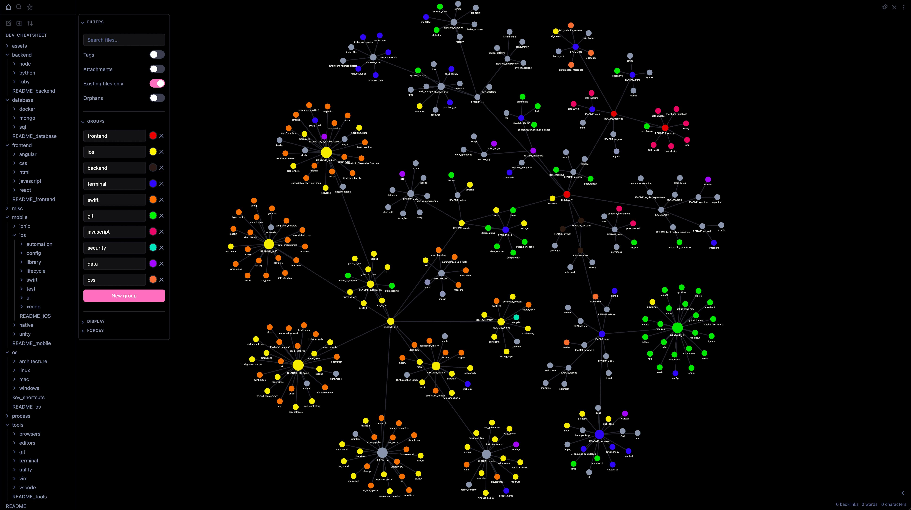

# Sensehack Developer Journal

## Intro

This is just a personal documentation or cheatsheet with personal examples for easy reference in future projects.

As sometimes, we would have limited internet access or restrictive data download policies. Personal Git documentation for specific programming languages, libraries & frameworks help a lot to quickly absorb the problem statement and work swiftly :P

### Hosted 
Local: [Obsidian](https://obsidian.md/)
Remote:  https://elegant-moonbeam-c40240.netlify.app/docs/summary/

## Content

Development Hell and most of CLI inputs used with bit of documentation so I’m not totally dependent on my Firefox Browser or my One Note / iA Writer App for accessing my documents on different terminal. I can just git clone this repository and boom we are up to date with my personal wiki or documentation.

### Includes

* Different issues I have faced.
* Architecture
* Concurrency
* Boilerplate Code
* Deprecated or obsolete commands or code flow
* Timeline of features
* Easy syntax
* Developer Rants
* Software Lifecycle
* Imposter Syndrome
* Internal Thoughts
* Opionated patterns

## Projects

Currently I have separate folders each assigned for their respective domain knowledge I have gained ever since I started working as a Software Engineer back in 2016.

iOS Dev Journey Repo: [swift repo](https://github.com/SensehacK/swift)
My Config: [sense-setup](https://github.com/SensehacK/sense-setup)
Other trials: [Playgrounds repo](https://github.com/SensehacK/playgrounds)

## Where the Beef ?

Checkout Summary file for whole project structure. Would recommend using `Obsidian` for full graph correlation of every topic related to its high level subdomains.

## Telemetry

### [Resources](misc/resources.md)
### [Hardware](hardware/README_hardware.md)
### [Software](tools/apps.md)
### [OS](os/README_os.md)

## Contact

[Kautilya Save](https://sensehack.github.io/)

[GitHub](https://github.com/SensehacK)

[LinkedIn](https://in.linkedin.com/in/kautilyasave)
