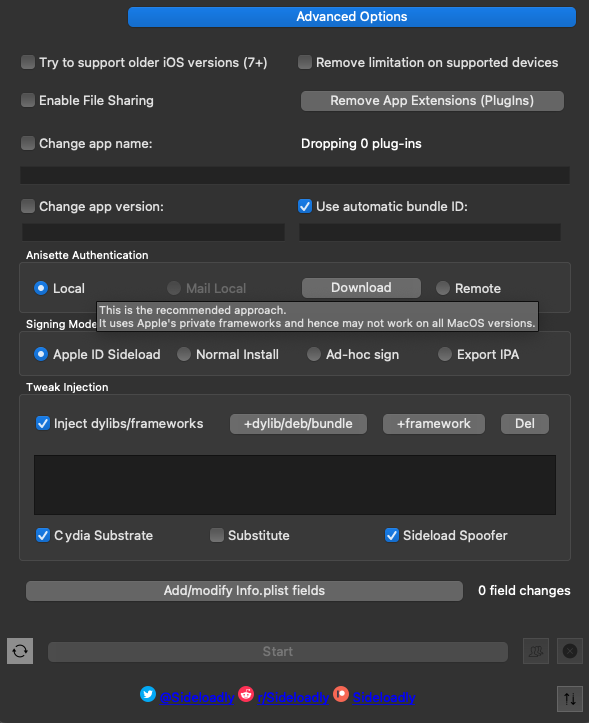
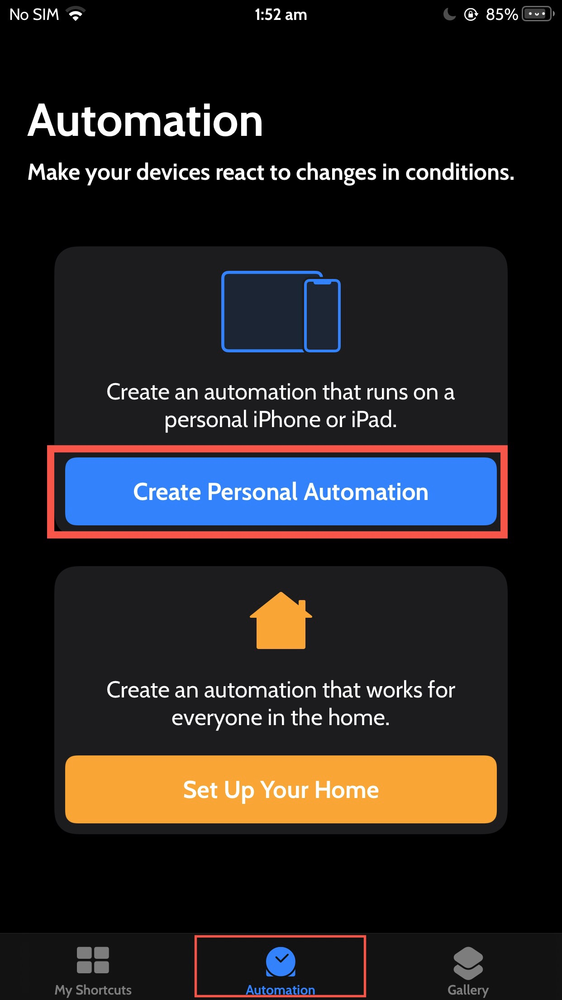
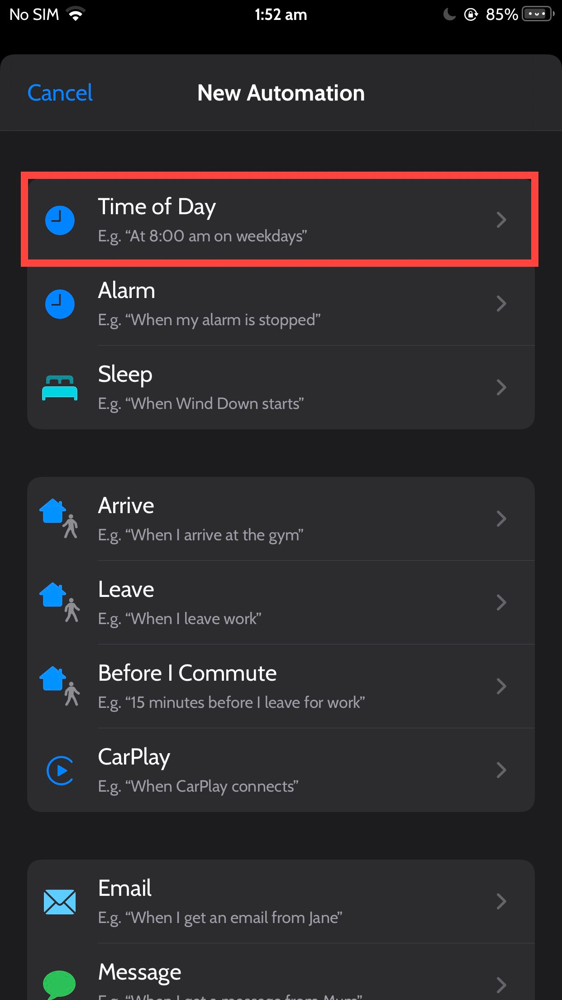
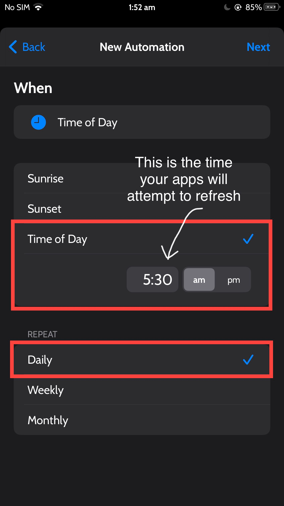
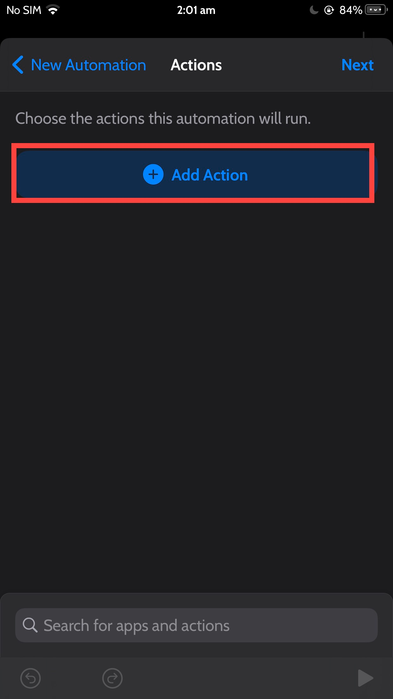
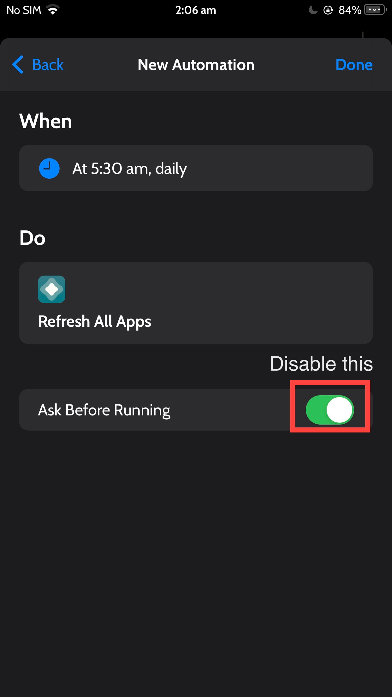
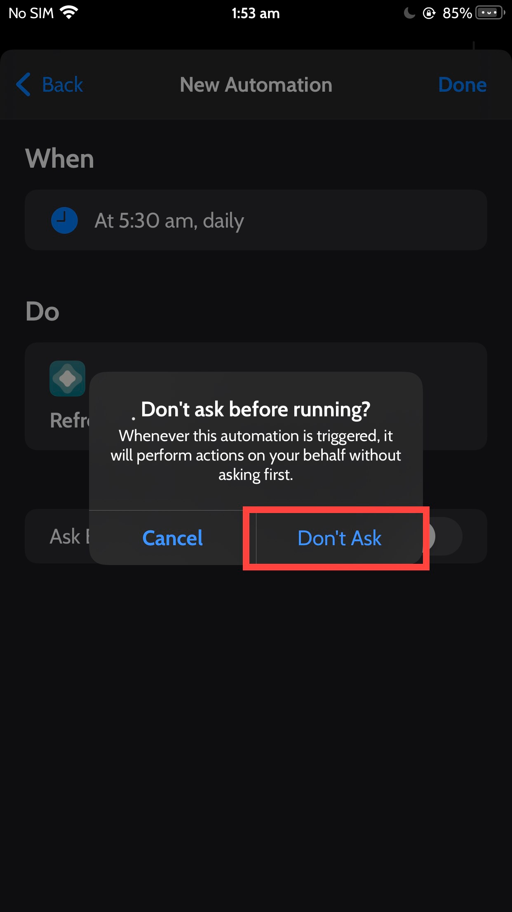

# Resigning

You can define resigning an app package in order to install it on your physical device. This is usually for testing purposes when you don't have developer profiles setup on newer devices or newer macs. Maybe you're testing a CI/CD server where your physical iOS, iPadOS devices are connected and you want to quickly deploy a dirty build for testing purposes without the hassle of setting up provisioning and other certificate - private public key pair authentication and integrity checks done by apple for not running un-signed code / packages / applications on device.


## Side Loading

First register the provisioning profile of the device you want to install the app on.
After that create a dummy xcode project and register the app identifier in order to make it easier to install the app for 365 days via enterprise route.
After that its easy peasy to just rename the `ipa` file with appropriate app identifier and install the app that way.
You have modded youtube, infuse and many more on your iOS device without the hassle of installing other tools to refresh every 7 days.

Also make sure you add your team ID to your default apps to override a unique string value for your bundle App ID.
Bundle ID and App ID

```text
com.google.ios.youtube
com.firecore.infuse
com.christianselig.Apollo

// convert to
com.google.ios.youtube.SN256SDGA
com.firecore.infuse.SN256SDGA
com.christianselig.Apollo.SN256SDGA
```


## Errors


### Mismatched Application Identifier Entitlement
```log
Installation failed: 0 MismatchedApplicationIdentifierEntitlement (Upgrade's application-identifier entitlement string (SN88Q889J9.com.google.ios.youtube.SN88Q889J9) does not match installed application's application-identifier string (EQHXZ8M8AV.com.google.ios.youtube); rejecting upgrade.)

FAILED: 0: MismatchedApplicationIdentifierEntitlement (Upgrade's application-identifier entitlement string (SN88Q889J9.com.google.ios.youtube.SN88Q889J9) does not match installed application's application-identifier string (EQHXZ8M8AV.com.google.ios.youtube); rejecting upgrade.)

I think we should just retry!
```

If you're trying to install similar app with bundle identifier it would fail

### Jailbreak or Tampering detection 

If the app you want to sideload is trying to check if the phone has been jailbroken or has different signature or different bundle identifier, just enable injection tweaks on sideloadly

[Open: sideloadly_sideload_spoofer.png](../../assets/2a7043566214d95f4da9e448fc3fc385_MD5.png)


Some apps like infuse won't work and show blank screens when you enable `tweak injection` to bypass detecting jailbreak.
Don't know what's wrong with it.
### Install failed: Guru Meditation

```error
ERROR: Guru Meditation 7c026a@447:14dd8f ('expected 1, found 0', ArrayError('expected 45, found 44', ArrayError('expected 3, found 1', SwitchError('no default case defined'))))
Install failed: Guru Meditation 7c026a@447:14dd8f ('expected 1, found 0', ArrayError('expected 45, found 44', ArrayError('expected 3, found 1', SwitchError('no default case defined'))))
```

Just use a different iOS iPA file to install

## Automatic Resigning 7 days Free account

There are so many guides to use to sign your apps with respect to apple account and running signed code on your physical device. 
One of the methods include using shortcuts 

Guide referenced from  [reddit post](https://www.reddit.com/r/AltStore/comments/15b6w4b/automate_daily_resigning_the_guide/)

THE GUIDE

1. Open the Shortcuts app (preinstalled on all devices)
    
2. Tap the “Automation” tab at the bottom, and tap “Create Personal Automation”


[](https://i.imgur.com/piv6nmP.jpg)
    
3. Tap “Time of Day”
[Open: Pasted image 20231004103449.png](../../assets/7b17a8d3aaecce89fea9939417bffd9b_MD5.png)

    
4. Set the time of day for your apps to refresh (For the purposes of this guide, I will use 5:30AM, but you may find that a different time works better for you), and MAKE SURE “Repeat” is set to Daily 
[Open: Pasted image 20231004103621.png](../../assets/85b04c0bb815805984095c388cfbd4a9_MD5.png)

    
5. Tap Next.
    
6. Tap “Add Action” [Open: Pasted image 20231004103652.png](../../assets/c73ad784778bd591c2b37e95372e6f7c_MD5.png)

    
7. Search “Refresh”, then tap the action titled “Refresh All Apps” with the AltStore app icon. 
    
8. Tap Next
    
9. DISABLE the “Ask Before Running” toggle [Open: Pasted image 20231004103716.png](../../assets/9016298270586fbb93524365fd6e007e_MD5.png)

    
10. Tap “Don’t Ask”! [Open: Pasted image 20231004103751.png](../../assets/ad8b17a8d57aeb3e30e3eebab144f1cf_MD5.png)

    
11. Tap Done
    
12. Profit


## Community Instructions


Source[iOSGods](https://iosgods.com)

// Start
**PC Installation Instructions:**  
**STEP 1:** If necessary, uninstall the app if you have it installed on your iDevice. Some hacked IPAs will install as a duplicate app. Make sure to back it up so you don't lose your progress.  
**STEP 2:** Download the pre-hacked .IPA file from the link above to your computer. To download from the iOSGods App, see [this tutorial topic](https://iosgods.com/topic/93697-installing-apps-from-the-iosgods-app-using-sideloadlycydia-impactor-on-your-pc/?do=findComment&comment=2881754).  
**STEP 3:** Download [Sideloadly](https://iosgods.com/topic/130167-introducing-sideloadly-working-cydia-impactor-alternative/) and install it on your PC.  
**STEP 4:** Open/Run Sideloadly on your computer, connect your iOS Device, and wait until your device name shows up.  
**STEP 5:** Once your iDevice appears, drag the modded .IPA file you downloaded and drop it inside the Sideloadly application.  
**STEP 6:** You will now have to enter your iTunes/Apple ID email login, press "Start" & then you will be asked to enter your password. Go ahead and enter the required information.  
**STEP 7:** Wait for Sideloadly to finish sideloading/installing the hacked IPA. If there are issues during installation, please read the note below.  
**STEP 8:** Once the installation is complete and you see the app on your Home Screen, you will need to go to **Settings** -> **General** -> **Profiles/VPN & Device Management**. Once there, tap on the email you entered from step 6, and then tap on '**Trust email@iosgods.com**'.  
**STEP 9:** Now go to your Home Screen and open the newly installed app and everything should work fine. You may need to follow further per app instructions inside the hack's popup in-game.  
  
**NOTE:** iOS/iPadOS 16 and later, you must [enable Developer Mode](https://iosgods.com/topic/161257-ios-16-developer-mode-what-is-it-how-to-enable/?do=findComment&comment=5163793). For free Apple Developer accounts, you will need to repeat this process every 7 days. Jailbroken iDevices can also use Sideloadly/Filza/IPA Installer to normally install the IPA with AppSync. If you have any questions or problems, **read** our [Sideloadly FAQ section of the topic](https://iosgods.com/topic/130167-windowsmacos-introducing-sideloadly-working-cydia-impactor-alternative/?do=findComment&comment=4107220) and if you don't find a solution, please post your issue down below and we'll do our best to help! If the hack does work for you, post your feedback below and help out other fellow members that are encountering issues.

// End

## Reddit Client Custom Third Party App

-  **Obtain Reddit Client-ID - API Credentials**
```steps
Step 1: Go to [https://reddit.com/prefs/apps](https://reddit.com/prefs/apps) and sign in
Step 2: Click the are you a developer? create an app... button
Step 3: Fill in the fields
name: Use whatever
Choose Installed App
description: can be left blank
about url: can be left blank
redirect uri: `apollo://reddit-oauth`
create app
```

- After creating the app you'll get a client identifier; it'll be a bunch of random characters. That is your API key.
- Install Apollo (w/ApolloPatcher) iPA file on iOS / iPadOS device.
- Enter the Client ID in the settings and tap "Set RedditClientID".

Source code
https://github.com/EthanArbuckle/Apollo-CustomApiCredentials

## Mac OS iPA

[Installing IPAs on Apple Silicon (M1)](https://gist.github.com/Dids/c43fc68677e1a3cc215d88a74e26d05e)


## Custom Apps

[Apollo for reddit](https://github.com/Balackburn/Apollo)

[Infuse Suffuse](https://github.com/Suffuse-Team/suffuse-team.github.io)

[uYouPlus or Enhanced](https://github.com/arichornlover/uYouEnhanced)