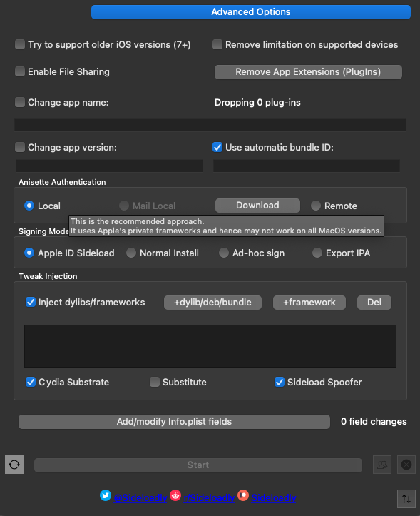
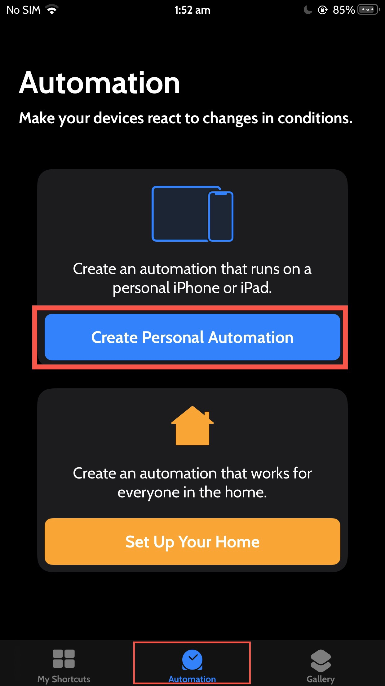
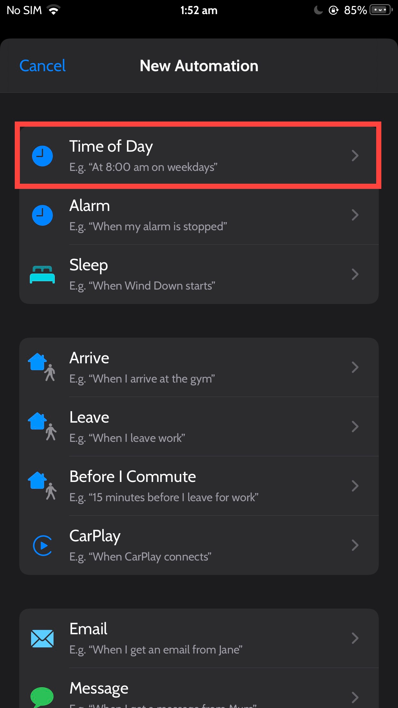
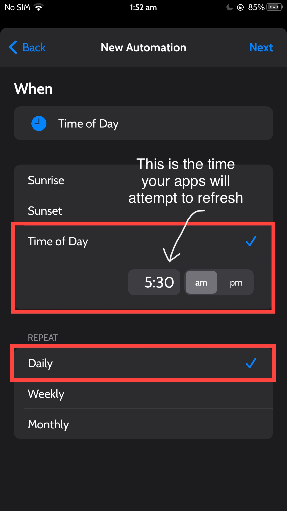
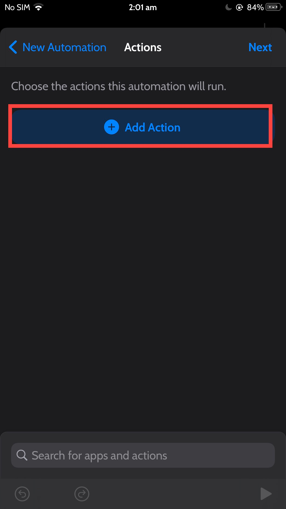
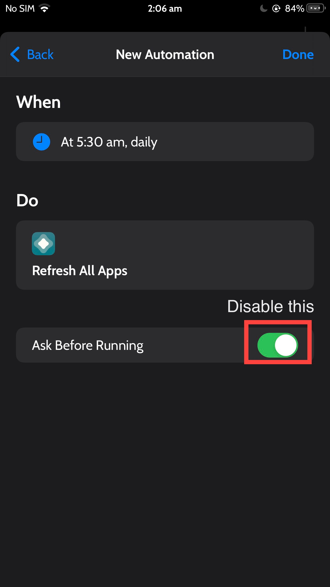
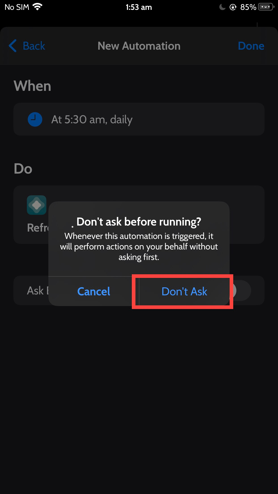

# Resigning

You can define resigning an app package in order to install it on your physical device. This is usually for testing purposes when you don't have developer profiles setup on newer devices or newer macs. Maybe you're testing a CI/CD server where your physical iOS, iPadOS devices are connected and you want to quickly deploy a dirty build for testing purposes without the hassle of setting up provisioning and other certificate - private public key pair authentication and integrity checks done by apple for not running un-signed code / packages / applications on device.

## Mind Map

[Jailbreak Tools](jailbreak.md#Tools)

## Side Loading

First register the provisioning profile of the device you want to install the app on.
After that create a dummy xcode project and register the app identifier in order to make it easier to install the app for 365 days via enterprise route.
After that its easy peasy to just rename the `ipa` file with appropriate app identifier and install the app that way.
You have modded youtube, infuse and many more on your iOS device without the hassle of installing other tools to refresh every 7 days.

Also make sure you add your team ID to your default apps to override a unique string value for your bundle App ID.
Bundle ID and App ID

```text
com.google.ios.youtube
com.firecore.infuse
com.christianselig.Apollo

// convert to
com.google.ios.youtube.SN256SDGA
com.firecore.infuse.SN256SDGA
com.christianselig.Apollo.SN256SDGA
```

## Signing

Esign is a tool used for signing iPA apps with Apple Developer/Distribution certificates and installing them. iOS 18 - iOS 8 jailbreak FInder App
[eSign github](https://github.com/iOS17/Esign)


## Sideloadly

Do stuff on tvOS

Pairing with tvOS

```tutorial
Step 1. First things first, download the latest version of Xcode from Mac App Store and then install it on your Mac.

Step 2. On Apple TV, navigate to Settings > Remotes and Devices > Remote App and Devices and keep your Apple TV on this screen.

Step 3. On Mac, launch Xcode and then navigate to Window > Devices and Simulators from the menu bar on top.

Step 4. Now if both your Mac and Apple TV are nearby, the following message should show up on Xcode’s Devices and Simulators window.

Step 5. Click on “Pair with [Your Apple TV]” button.

Step 6. A verification code will pop up on Apple TV display, type it in Xcode to complete the pairing process between your Mac and Apple TV.

You should now have your Mac showing up on Apple TV’s Remote App and Devices screen. You should also have your Apple TV now showing up on Xcode’s Devices and Simulators window.

And that’s about it.

Your Apple TV should show up on the list of devices on Sideloadly :)
```

[reddit tutorial source](https://www.reddit.com/r/sideloaded/comments/13q3geq/comment/jleamun/?utm_source=share&utm_medium=web3x&utm_name=web3xcss&utm_term=1&utm_content=share_button)


## Errors


### Mismatched Application Identifier Entitlement
```log
Installation failed: 0 MismatchedApplicationIdentifierEntitlement (Upgrade's application-identifier entitlement string (SN88Q889J9.com.google.ios.youtube.SN88Q889J9) does not match installed application's application-identifier string (EQHXZ8M8AV.com.google.ios.youtube); rejecting upgrade.)

FAILED: 0: MismatchedApplicationIdentifierEntitlement (Upgrade's application-identifier entitlement string (SN88Q889J9.com.google.ios.youtube.SN88Q889J9) does not match installed application's application-identifier string (EQHXZ8M8AV.com.google.ios.youtube); rejecting upgrade.)

I think we should just retry!
```

If you're trying to install similar app with bundle identifier it would fail

### Jailbreak or Tampering detection 

If the app you want to sideload is trying to check if the phone has been jailbroken or has different signature or different bundle identifier, just enable injection tweaks on sideloadly

[Open: sideloadly_sideload_spoofer.png](../../assets/2a7043566214d95f4da9e448fc3fc385_MD5.png)


Some apps like infuse won't work and show blank screens when you enable `tweak injection` to bypass detecting jailbreak.
Don't know what's wrong with it.
### Install failed: Guru Meditation

```error
ERROR: Guru Meditation 7c026a@447:14dd8f ('expected 1, found 0', ArrayError('expected 45, found 44', ArrayError('expected 3, found 1', SwitchError('no default case defined'))))
Install failed: Guru Meditation 7c026a@447:14dd8f ('expected 1, found 0', ArrayError('expected 45, found 44', ArrayError('expected 3, found 1', SwitchError('no default case defined'))))
```

Just use a different iOS iPA file to install

### ApplicationVerificationFailed

```
There was an issue during installation: 3892346881: ApplicationVerificationFailed (Failed to verify code signature of /var/installd/Library/Caches/com.apple.mobile.installd.staging/temp.tOBasF/extracted/Payload/Apollo.app : 0xe8008001 (An unknown error has occurred.))
```

### App ID with Identifier not available


```
Install failed: Guru Meditation 0db732@934:3aea77 Failed: (9401) An App ID with Identifier 'com.firecore.infuse2' is not available. Please enter a different string
```

Just used different ID


### max retries

```
Obtaining team ID

Install failed: Guru Meditation 31f6e7@519:c3b6e4 HTTPSConnectionPool(host='developerservices2.apple.com', port=443): Max retries exceeded with url: /services/QH65B2/listTeams.action?clientId=XABBG36SBA (Caused by NewConnectionError('<urllib3.connection.HTTPSConnection object at 0x7fe3612c5160>: Failed to establish a new connection: [Errno 9] Bad file descriptor'))
```


### App verification failed

```
Installation failed: 3892346903 ApplicationVerificationFailed (Failed to verify code signature of /var/installd/Library/Caches/com.apple.mobile.installd.staging/temp.TU6b0H/extracted/Payload/Spotify.app : 0xe8008017 (A signed resource has been added, modified, or deleted.))


Installation failed: 3892346881 ApplicationVerificationFailed (Failed to verify code signature of /var/installd/Library/Caches/com.apple.mobile.installd.staging/temp.J4CU1i/extracted/Payload/Apollo.app : 0xe8008001 (An unknown error has occurred.))


```


## MacOS 


```
Solved! for someone coming to this thread even at the start of 2024.

[u/ssj4gogeta2003](https://www.reddit.com/user/ssj4gogeta2003/) You saved my days! I was annoyed when I switched my Mac to MacBook Pro 2019 with the latest MacOS 14.2.1 and iOS 17.2.1. I was facing the error for 2FA because Sideloadly was not popping up and asking for a 2FA code on its latest version v0.50.1. Then I followed these steps and it worked successfully!

1. Open the Music app on your Mac.
    
2. Go to Accounts => Authorisations => click Authorise this computer...
    
3. Next Log into your Apple ID (if not logged in previously), follow the steps one by one by entering your Apple ID email, password, and 2FA code sent to your phone number.
    
4. Open again Sideloadly app (keeping Music app open) and you will no longer face the issue. Enjoy!!!
    

If it still does not work, try a few other things which I did but not sure if they are necessary for the flow.

- Open Mail app on Mac, Sign in if not already and keep Mail app open.
    
- Reinstall Sideloadly app.
```

## Automatic Resigning 7 days Free account

There are so many guides to use to sign your apps with respect to apple account and running signed code on your physical device. 
One of the methods include using shortcuts 

Guide referenced from  [reddit post](https://www.reddit.com/r/AltStore/comments/15b6w4b/automate_daily_resigning_the_guide/)

THE GUIDE

1. Open the Shortcuts app (preinstalled on all devices)
    
2. Tap the “Automation” tab at the bottom, and tap “Create Personal Automation”


[](https://i.imgur.com/piv6nmP.jpg)
    
3. Tap “Time of Day”
[Open: Pasted image 20231004103449.png](../../assets/7b17a8d3aaecce89fea9939417bffd9b_MD5.png)

    
4. Set the time of day for your apps to refresh (For the purposes of this guide, I will use 5:30AM, but you may find that a different time works better for you), and MAKE SURE “Repeat” is set to Daily 
[Open: Pasted image 20231004103621.png](../../assets/85b04c0bb815805984095c388cfbd4a9_MD5.png)

    
5. Tap Next.
    
6. Tap “Add Action” [Open: Pasted image 20231004103652.png](../../assets/c73ad784778bd591c2b37e95372e6f7c_MD5.png)

    
7. Search “Refresh”, then tap the action titled “Refresh All Apps” with the AltStore app icon. 
    
8. Tap Next
    
9. DISABLE the “Ask Before Running” toggle [Open: Pasted image 20231004103716.png](../../assets/9016298270586fbb93524365fd6e007e_MD5.png)

    
10. Tap “Don’t Ask”! [Open: Pasted image 20231004103751.png](../../assets/ad8b17a8d57aeb3e30e3eebab144f1cf_MD5.png)

    
11. Tap Done
    
12. Profit


## Community Instructions


Source[iOSGods](https://iosgods.com)

// Start
**PC Installation Instructions:**  
**STEP 1:** If necessary, uninstall the app if you have it installed on your iDevice. Some hacked IPAs will install as a duplicate app. Make sure to back it up so you don't lose your progress.  
**STEP 2:** Download the pre-hacked .IPA file from the link above to your computer. To download from the iOSGods App, see [this tutorial topic](https://iosgods.com/topic/93697-installing-apps-from-the-iosgods-app-using-sideloadlycydia-impactor-on-your-pc/?do=findComment&comment=2881754).  
**STEP 3:** Download [Sideloadly](https://iosgods.com/topic/130167-introducing-sideloadly-working-cydia-impactor-alternative/) and install it on your PC.  
**STEP 4:** Open/Run Sideloadly on your computer, connect your iOS Device, and wait until your device name shows up.  
**STEP 5:** Once your iDevice appears, drag the modded .IPA file you downloaded and drop it inside the Sideloadly application.  
**STEP 6:** You will now have to enter your iTunes/Apple ID email login, press "Start" & then you will be asked to enter your password. Go ahead and enter the required information.  
**STEP 7:** Wait for Sideloadly to finish sideloading/installing the hacked IPA. If there are issues during installation, please read the note below.  
**STEP 8:** Once the installation is complete and you see the app on your Home Screen, you will need to go to **Settings** -> **General** -> **Profiles/VPN & Device Management**. Once there, tap on the email you entered from step 6, and then tap on '**Trust email@iosgods.com**'.  
**STEP 9:** Now go to your Home Screen and open the newly installed app and everything should work fine. You may need to follow further per app instructions inside the hack's popup in-game.  
  
**NOTE:** iOS/iPadOS 16 and later, you must [enable Developer Mode](https://iosgods.com/topic/161257-ios-16-developer-mode-what-is-it-how-to-enable/?do=findComment&comment=5163793). For free Apple Developer accounts, you will need to repeat this process every 7 days. Jailbroken iDevices can also use Sideloadly/Filza/IPA Installer to normally install the IPA with AppSync. If you have any questions or problems, **read** our [Sideloadly FAQ section of the topic](https://iosgods.com/topic/130167-windowsmacos-introducing-sideloadly-working-cydia-impactor-alternative/?do=findComment&comment=4107220) and if you don't find a solution, please post your issue down below and we'll do our best to help! If the hack does work for you, post your feedback below and help out other fellow members that are encountering issues.

// End


## macOS

[Installing IPAs on Apple Silicon (M1)](https://gist.github.com/Dids/c43fc68677e1a3cc215d88a74e26d05e)


## visionOS

### Developer Mode

1. Setup developer mode and connect the AVP to Xcode over Wi-Fi. Instructions for this are on the Apple developer website
2. Create a shell project in Xcode and build the app for your AVP. Ensure that it runs properly
3. Download IOS App Signer 2 and the .ipa file of the app you want to sideload. CustomApp can be downloaded from its Github. Using your developer team and the bundle identifier that was created from the shell project, build a signed ipa file.
4. On the devices and simulators page in Xcode, select your AVP and drag the outputted ipa file to the installed app list
5. Trust the profile in device management settings on the AVP
6. Done!


## Keychain Access

macOS quirks

[SO | Xcode codesign wants to use the "Apple Development" keychain password wrong](https://stackoverflow.com/questions/71639924/xcode-codesign-wants-to-use-the-apple-development-keychain-password-wrong)

Force quitting keychain access also fixed this issue for me.


### Libraries version mismatch

```log
Checking private key
Generating keypair
ERROR: Guru Meditation da8d42@156:ad7080 Libraries version mismatch, please reinstall Sideloadly!
Install failed: Guru Meditation da8d42@156:ad7080 Libraries version mismatch, please reinstall Sideloadly!
```

Just a reinstall worked fine for me on Sideloadly.


## iLoader


```
 ● Failed to log in to Apple ID
 ├ /Users/runner/.cargo/registry/src/index.crates.io-1949cf8c6b5b557f/isideload-0.2.11/src/auth/apple_account.rs:106
 │
 ● Failed to get anisette data for login
 ├ /Users/runner/.cargo/registry/src/index.crates.io-1949cf8c6b5b557f/isideload-0.2.11/src/auth/apple_account.rs:365
 │
 ● Failed to provision
 ├ /Users/runner/.cargo/registry/src/index.crates.io-1949cf8c6b5b557f/isideload-0.2.11/src/anisette/remote_v3/mod.rs:189
 │
 ● Failed to connect to provisioning socket
 ├ /Users/runner/.cargo/registry/src/index.crates.io-1949cf8c6b5b557f/isideload-0.2.11/src/anisette/remote_v3/mod.rs:244
 │
 ● IO error: invalid peer certificate: UnknownIssuer
 ╰ /Users/runner/.cargo/registry/src/index.crates.io-1949cf8c6b5b557f/isideload-0.2.11/src/anisette/remote_v3/mod.rs:244
```


## ILoader Guide

Copied off 
https://gist.github.com/sinceohsix/688637ac04695d1ff38f844acc8ba7f3

### ✴️ How to sideload with SideStore and LiveContainer
Last Edited: Dec 21, 2025 @ 6:34PM PST · **Supports iOS versions 15.0 - 26.3 Beta**  
> <sub> Make sure you are always using up-to-date guides to ensure full compatibility. The official SideStore documentation can be found [here](https://docs.sidestore.io) in case anything changes. For additional information and credits, scroll to the bottom of this page. </sub>

---

👋 **Hello again, r/sideloaded!**

This is version 2.0 of my iOS sideloading guide. By the end of this guide, you will be able to:
- Sideload apps using SideStore
- Use LiveContainer to workaround the 3-app-limit

This method uses **community-made tools** and **Apple-approved sideloading methods**, and only requires a computer for initial setup.

**What are SideStore and LiveContainer?**  
SideStore is an app that allows you to install `.ipa` files (iOS Applications) to your iDevice. LiveContainer is an app that allows you to *run* iOS applications without installing them. Since iOS has a limit of 3 installed apps when sideloading using a free developer account, a special version of LiveContainer that integrates the SideStore app is available.

Here is what we will go over in this guide:
1. Preparation
2. Using iloader to install SideStore
3. Setting up SideStore
4. Switching to SideStore + LiveContainer

**This guide assumes you don't already have SideStore or LiveContainer installed.** If you do, you may encounter issues. If you want to follow this guide, uninstall your current SideStore and/or LiveContainer apps.

---

### 1. Preparation
Before sideloading, we need to prepare your device and install the required software.

💻 **On Your PC/Mac**  
- [iTunes](https://apple.co/ms) (Only required on Windows)  
- [iloader](https://github.com/nab138/iloader/releases/tag/v1.1.5)

📱 **On Your iPhone / iPad**  
- [LocalDevVPN](https://apps.apple.com/us/app/localdevvpn/id6755608044)

---

### 2. Using iloader to install SideStore
We will now install SideStore, this app allows you to sideload `.ipa` files to your iDevice. Start by launching iloader.

**Step 1:** Select **Add Account +** and sign into your Apple Account.  

**Step 2:** Plug your iPhone / iPad into your computer. (You may need to press **Refresh Devices**).  

**Step 3:** Under the `Devices` section, select the device you want to install SideStore to.  

**Step 4:** Under the `Installers` section, select **SideStore (Stable)**.  

Now, just wait patiently. SideStore will be installed shortly. :)

--- 

### 3. Setting up SideStore
Before you can use SideStore to install apps, you have to enable Developer Mode, allow apps from your Apple Account, and refresh SideStore.

**Step 1:** Open **Settings**, then go to `General > VPN & Device Management`.

**Step 2:** You should see the email of the Apple Account you used in iloader, tap on it, then trust the developer.

**Step 3:** Back out to the main Settings menu, then scroll to `Privacy and Security`.

**Step 4:** Scroll to `Security`, tap **Developer Mode**, then toggle it on. Follow the given directions. (Only for iOS 16.0+)

**Step 5:** Once your device restarts, open **LocalDevVPN**. Tap **Connect**.  
> ℹ️ LocalDevVPN is required for SideStore to install and refresh sideloaded apps. Make sure you're connected before trying to use SideStore!

**Step 6:** Tap **Allow**, then enter your passcode.

**Step 7:** Open **SideStore**, navigate to `My Apps`, then tap **7 DAYS** next to SideStore.

**Step 8:** Login to the same Apple Account you used in iloader.

Once SideStore refreshes, you are free to sideload any .ipa file you want! SideStore has support for AltStore sources meaning you can add sources and use SideStore as a third party app store as well. You will need to enable LocalDevVPN before installing apps. You can stop here if you only want SideStore but you will only be able to install 2 additional apps, if you want to install LiveContainer + SideStore, continue to the next section.

---

### 4. Switching to LiveContainer + SideStore
Switching to SideStore + LiveContainer allows you to install `.ipa` files and run applications directly in the LiveContainer app while keeping SideStore functionality and two free app slots. We'll install the LiveContainer `.ipa` then inject our pairing file again with iloader.

**Step 1:** Download the latest LiveContainer + SideStore `.ipa` on your iDevice — [Stable](https://github.com/LiveContainer/LiveContainer/releases/latest/download/LiveContainer+SideStore.ipa) / [Nightly](https://github.com/LiveContainer/LiveContainer/releases/download/nightly/LiveContainer+SideStore.ipa)

> Stable is the latest **recommended** release. Nightly has cutting-edge features but may be more buggy. Nightly builds are not recommended for average users.

**Step 2:** Open **SideStore**, then go to `My Apps`. Tap the **+** in the top-left corner and select the downloaded `LiveContainer+SideStore.ipa`. 

**Step 3:** When you see a prompt, tap **Keep App Extensions (Use Main Profile)**. Wait for installation to finish, then open LiveContainer.

**Step 4:** Tap the SideStore icon in the top-left corner. When you're asked to select your pairing file, navigate to `On My iPhone / iPad > SideStore` and select `ALTPairingFile.mobiledevicepairing`.

**Step 5:** Navigate to `My Apps`, then tap **7 DAYS** next to LiveContainer.

**Step 6:** Login to the same Apple Account you used in iloader. Wait for the app to refresh.

**Step 7:** Delete the standalone SideStore app.

**Step 8:** Close LiveContainer then open it again. Go to `Settings`, then tap **Import Certificate From SideStore**, and **OK**.

**Step 9:** Tap **JIT-Less Mode Diagnose**, then **Test JIT-Less Mode**. The test should pass.

You can now install as many apps as you want within LiveContainer. LiveContainer (Nightly) also has support for AltSources within the LiveContainer app itself!

***Disclaimer:***
> LiveContainer + SideStore is bundled with an outdated nightly version of SideStore; this means you will encounter issues specific to LiveContainer + SideStore.  For support, either [open an issue on the LiveContainer GitHub repository](https://github.com/LiveContainer/LiveContainer/issues) or in the [#support-forum](https://discord.com/channels/949183273383395328/1020114888720384032) channel on the [SideStore Discord server](https://dis.sidestore.io). Please do not ask for support in the regular SideStore support channels.

---

### ❇️ You did it!
Setup is complete and you can now install as many apps as you want using LiveContainer! For clarification, apps installed in LiveContainer will *not* contribute to the 3-app-limit, while installing apps with SideStore (even from LiveContainer) *will* count towards your 3-app-limit. 

Keep in mind that sideloaded apps must be refreshed every 7 days or they will expire and you will need to follow this guide again. This process can be **fully automated** using the Shortcuts app and automations (I'll write a separate guide for this later on).

If you want a unique source of apps and games to try out, consider adding *my* source to SideStore or LiveContainer! You can find it at the link below:

```
https://sinceohsix.github.io/ipas/source.json
```

#### ℹ️ Additional Information and Credits
The software used in this guide was made by real people using hours, days, and weeks of their time, please make sure you are respectful to them and show support when you can. 

For additional information and support regarding the tools and software used, their GitHub repositories, documentation sites, Discord servers, and other sites are all linked below. If you have questions or concerns, reach out in a support channel or open an issue.

**Links:**  

[SideStore Documentation](https://docs.sidestore.io)  
[LiveContainer Documentation](https://livecontainer.github.io/docs/intro)

[nab138/iloader](https://github.com/nab138/iloader)  
[LiveContainer/LiveContainer](https://github.com/LiveContainer/LiveContainer)  
[SideStore/SideStore](https://github.com/SideStore/SideStore/)

[SideStore Discord Server](https://dis.sidestore.io)  
[idevice Discord Server](https://discord.gg/pCZEJ3u8)

[SideStore Website](https://sidestore.io)

**Also, special thanks to [suprstarrd](https://github.com/suprstarrd) for helping out and proof-reading this for me!**

*- eli*