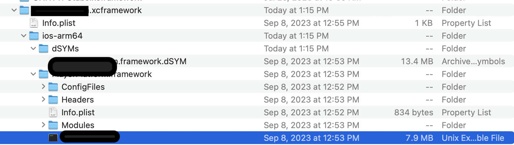

# Framework

## Overview

It is a bundle of resources. Could include code, assets, bridging headers, documentation, UI code etc. 

## Purpose

Frameworks have important purposes
- Encapsulation
- Reusability
- Modularization

## Mind Map

[Xcode Build process Mind Map link](ios/xcode/build.md)

[packaging](packaging.md)

## Process

Xcode Build Process around Frameworks
### Static vs Dynamic

Static - unit of codebase linked at compile time. Which doesn't change

Dynamic - binds symbols at runtime execution. Recommended approach to save storage. But has performance costs when the compiler does dynamic linking with `Mach-O` llvm and other process stuff.

Dynamic libraries are most of the times slow since it will link those library on app startup.
Static won't have to deal with linking on app startup but it will increase the app size. Also it could be fast but depends on how many libraries you load at startup.

Embedding in the app executable or not.

### Choice

In this also you can static or dynamic framework - same concept applies about generating / linking those assets internally. There is always a cost for storage or performance you have to pay with any approach. 

### Tangent

I got on a tangent about software updates in this post. Not fully technical but my thoughts.
[software_updates](software_updates.md)

So which is better ? 
**insert Senior Engineer Meme**:  **IT DEPENDS!**  
### Mach - O
`ABI` - `Application Binary Interface`

### Different extensions

`.tld` vs `.dylib` framework libraries embedding in Xcode . 
Linking binaries - embed or just dynamically link it to save space.

More sources around this topic

Apple WWDC 2018 talk

https://developer.apple.com/videos/play/wwdc2018/415/?time=2858

https://www.swift.org/blog/abi-stability-and-more/

https://stackoverflow.com/questions/15331056/library-static-dynamic-or-framework-project-inside-another-project?noredirect=1&lq=1

https://stackoverflow.com/questions/31450690/why-xcode-7-shows-tbd-instead-of-dylib


### Diff FAT and xcFramework

[FAT binary](https://en.wikipedia.org/wiki/Fat_binary) is a bundle of all the architecture object files executable to run. So its more bigger and wasteful with its storage, network and cpu resources.

XCFramework on the other hand is just a structured folder/ wrapper. It has distinct directories designated for each platform where it contains a binary. This binary could be a FAT (Multi architecture) or a non FAT (Single architecture).


## Frameworks Guide
### Creating Frameworks

[kodeco | creating-a-framework-for-ios](https://www.kodeco.com/17753301-creating-a-framework-for-ios)

### Extracting frameworks


Sample project structure for videoKit
https://github.com/SensehacK/swift/blob/master/swiftUI/VideoContent/README.md


### Code Signing XcFramework


https://stackoverflow.com/questions/30963294/creating-ios-osx-frameworks-is-it-necessary-to-codesign-them-before-distributin

https://ioscodesigning.com/code-signing-ios-frameworks/

CMAKE to provide the code signing identity 
`set_target_properties(dynamicFramework PROPERTIES` 
`XCODE_ATTRIBUTE_CODE_SIGN_IDENTITY`
https://cmake.org/cmake/help/v3.26/prop_tgt/FRAMEWORK.html


[Relevant Code signing Hell article](https://mtldoc.com/swift/2022/12/23/xcframework-code-signing) 

https://developer.apple.com/documentation/Xcode/verifying-the-origin-of-your-xcframeworks

[WWDC 2023 Verify app dependencies with digital signatures](https://developer.apple.com/videos/play/wwdc2023/10061)

### Optimizing Frameworks

[Libraries with resources optimized for build time and application size](https://ilya.puchka.me/libraries-with-resources-optimized-for-build-time-and-application-size/)

Does my app gets bloated with all the platform architecture combinations that we don't need to provide. No for xcFrameworks since it will automatically select the right arch + platform combo while submitting the archive file or generating the `ipa` file. 
If you have FAT binaries then you could have extra architecture bloatware depending on how you sliced or thinned the binary while creating it.


## Debugging 

The process usually for debugging `xcframework` is described below. As described by my team member.

1. if you install a `.xcframework` into a client application, it's generally built with  optimization, so there are no debug symbols and you can't break point that code
2. However, if you have access to the dependency code, like `ProjectPlatform`, you can build a `framework` file locally without optimization so  [debug symbols (dSYM)](apple_terms.md#dSYM) are included in that binary/app bundle.
3. If you copy that module information into the dependency's `.xcframework` on the client app, you can essentially "fake" the build system because now it will run the framework code as if there are debug symbols. 





Third point does it relates to actually opening up client dependency frameworks and swapping the `object-linked` file? Will have to test this theory as well or read more about hot swapping the binary files.

Edit: We can just swap out the `Unix Executable file` binary file with our locally built binary file with no optimization and the `.xcFramework` directory would also include `dSYMs` directory for specific os architecture.

[SO | How can I debug in a framework in Xcode?](https://stackoverflow.com/questions/15654493/how-can-i-debug-in-a-framework-in-xcode)


### Distributing

### Binary 

Make binaries available to other developers by creating Swift packages that include one or more XCFrameworks.
[Distributing binary frameworks as Swift packages](https://developer.apple.com/documentation/xcode/distributing-binary-frameworks-as-swift-packages)

### Multiple apps out of a framework? 

[SO | build-multiple-ios-apps-out-of-a-framework](https://stackoverflow.com/questions/21415658/build-multiple-ios-apps-out-of-a-framework?rq=3)

## Modularization

[How to prepare your iOS project to support modular architecture](https://sarunw.com/posts/how-to-prepare-ios-project-for-modular-architecture/)

## [Errors](framework_errors.md)
## Build Output

- If you're building a **debug** config, then it will only build for the CPU architecture of the destination's platform. Meaning:
    
    - If you're building into your iPhone, you'll just need to support ARM64
    - If you're building into a simulator, you'll just need to support X86_64

- If you're building a **release** config, then it will:
    - Build for **both** platforms and all possible architectures.

Given that choice, the Apple Silicon M1 (and M2) chip is an AArch64 architecture.

AArch64 is another name for ARM64, so it is an ARM architecture.

The AMD64 architecture is what is also known as x86_64, x64 or even Intel 64-bit architecture. This is what you would typically see in slightly older Macs introduced before Apple Silicon.

You can check the architecture of your own computer by opening the Terminal application, and running the following command:
On the M1, Mx chip it will display: `arm64`
Intel chip will display: i386

```sh
arch
```
Note - if you have checked `Open in Rosetta` for your terminal settings then even on `Mx` arm64 chips it will show `i386`
[Source SO](https://apple.stackexchange.com/a/451240)

### x86 Intel / amd64 AMD CPUs

- Debug 
	- iPhone - ARM64
	- Simulator - X86_64
- Release
	- Both Platform and all possible architectures

### ARM CPUs
- Debug 
	- iPhone - ARM64
	- Simulator - ARM64
	- Rosetta Enabled on Xcode Simulator - X86_64
- Release
	- Both Platform and all possible architectures


## Resources

[Swift code reuse made simple: packages, modules, libraries - Julia Vashchenko - Swift Heroes 2019](https://www.youtube.com/watch?v=w3QGc8wWTIg)

[Apple Silicon and Library incompatibility](https://susuthapa19961227.medium.com/apple-silicon-and-the-library-incompatibility-problem-for-ios-development-8c2d875283f2) 

[Migration from Intel to ARM](https://blog.codemagic.io/migrating-intel-m1-silicon/) 

[Migrating Pre-compiled libraries from vendors](https://developer.apple.com/documentation/technotes/tn3117-resolving-build-errors-for-apple-silicon#Update-pre-compiled-libraries-from-vendors)

[Swift PM with CI](https://medium.com/uptech-team/swift-package-manager-and-how-to-cache-it-with-ci-14968cd58c5f)

[Multiplatform binary framework](https://developer.apple.com/documentation/Xcode/creating-a-multi-platform-binary-framework-bundle)

[XcFramework examples](https://github.com/bielikb/xcframeworks)

