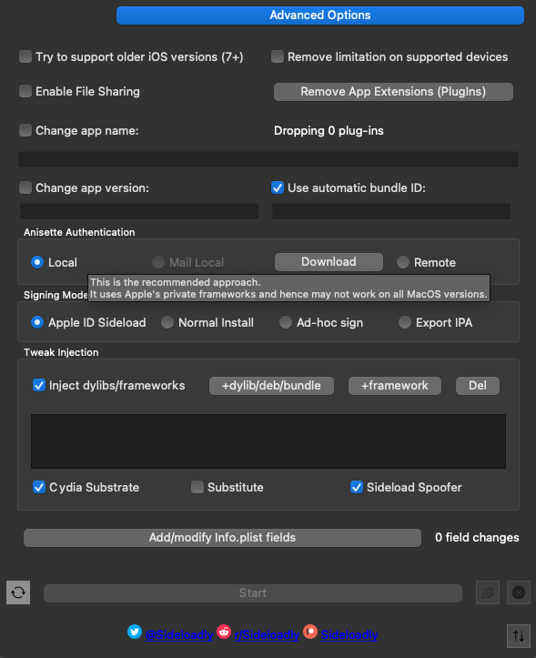
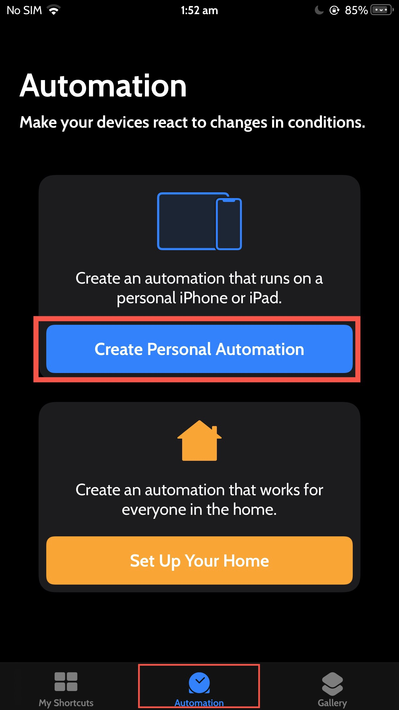
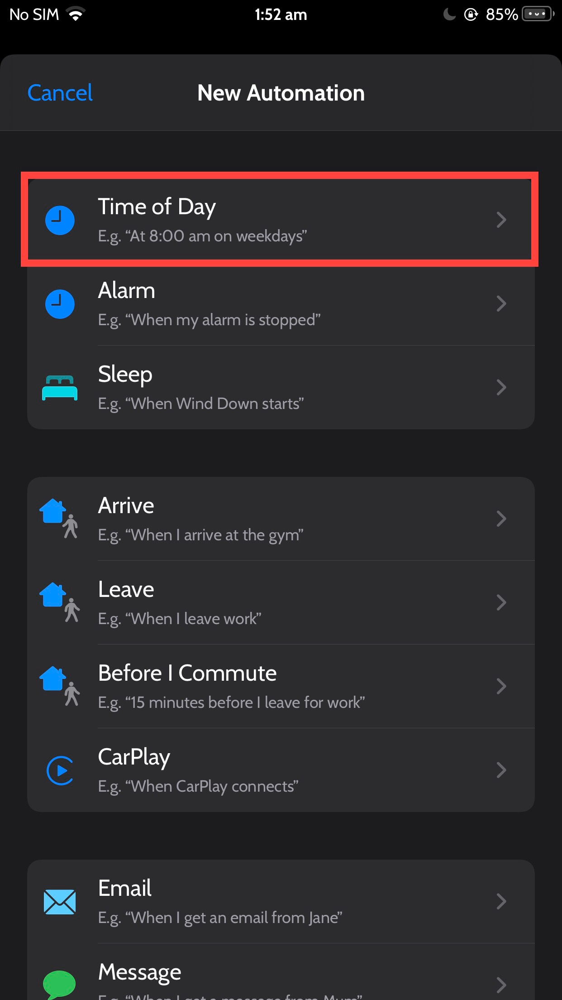
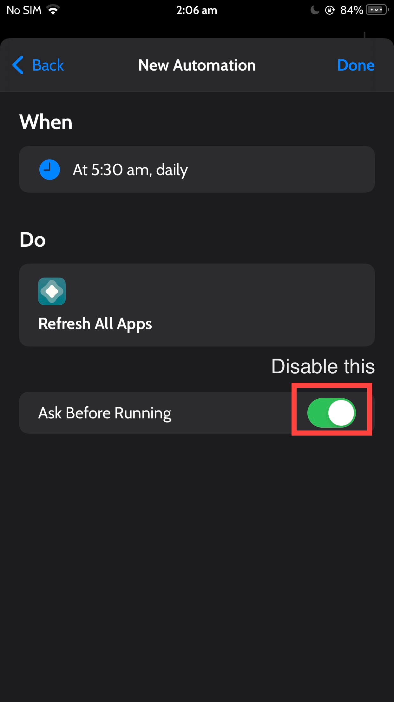

# Jailbreak

## Mobile Substrate

Getting started with Mobile Substrate tweaking.

[SO](https://stackoverflow.com/questions/6118814/is-there-anywhere-where-i-could-start-mobilesubstrate-tweaks-programming/11553722)


## Update packages

In terminal type (after loging with su):
```bash
mkdir -p var/cache/apt/archives/partial
apt-get update
```


## Side Loading

First register the provisioning profile of the device you want to install the app on.
After that create a dummy xcode project and register the app identifier in order to make it easier to install the app for 365 days via enterprise route.
After that its easy peasy to just rename the `ipa` file with appropriate app identifier and install the app that way.
You have modded youtube, infuse and many more on your iOS device without the hassle of installing other tools to refresh every 7 days.


#### Errors

```log
Installation failed: 0 MismatchedApplicationIdentifierEntitlement (Upgrade's application-identifier entitlement string (SN88Q889J9.com.google.ios.youtube.SN88Q889J9) does not match installed application's application-identifier string (EQHXZ8M8AV.com.google.ios.youtube); rejecting upgrade.)

FAILED: 0: MismatchedApplicationIdentifierEntitlement (Upgrade's application-identifier entitlement string (SN88Q889J9.com.google.ios.youtube.SN88Q889J9) does not match installed application's application-identifier string (EQHXZ8M8AV.com.google.ios.youtube); rejecting upgrade.)

I think we should just retry!
```

If you're trying to install similar app with bundle identifier it would fail

#### Jailbreak or Tampering detection 

If the app you want to sideload is trying to check if the phone has been jailbroken or has different signature or different bundle identifier, just enable injection tweaks on sideloadly

[Open: sideloadly_sideload_spoofer.png](../../assets/2a7043566214d95f4da9e448fc3fc385_MD5.png)



## Automatic Resigning 7 days Free account

There are so many guides to use to sign your apps with respect to apple account and running signed code on your physical device. 
One of the methods include using shortcuts 

Guide referenced from  [reddit post](https://www.reddit.com/r/AltStore/comments/15b6w4b/automate_daily_resigning_the_guide/)

THE GUIDE

1. Open the Shortcuts app (preinstalled on all devices)
    
2. Tap the “Automation” tab at the bottom, and tap “Create Personal Automation”


[](https://i.imgur.com/piv6nmP.jpg)
    
3. Tap “Time of Day”
[Open: Pasted image 20231004103449.png](../../assets/7b17a8d3aaecce89fea9939417bffd9b_MD5.png)

    
4. Set the time of day for your apps to refresh (For the purposes of this guide, I will use 5:30AM, but you may find that a different time works better for you), and MAKE SURE “Repeat” is set to Daily 
[Open: Pasted image 20231004103621.png](../../assets/85b04c0bb815805984095c388cfbd4a9_MD5.png)

    
5. Tap Next.
    
6. Tap “Add Action” [Open: Pasted image 20231004103652.png](../../assets/c73ad784778bd591c2b37e95372e6f7c_MD5.png)

    
7. Search “Refresh”, then tap the action titled “Refresh All Apps” with the AltStore app icon. 
    
8. Tap Next
    
9. DISABLE the “Ask Before Running” toggle [Open: Pasted image 20231004103716.png](../../assets/9016298270586fbb93524365fd6e007e_MD5.png)

    
10. Tap “Don’t Ask”! [Open: Pasted image 20231004103751.png](../../assets/ad8b17a8d57aeb3e30e3eebab144f1cf_MD5.png)

    
11. Tap Done
    
12. Profit


## Tools


https://sideloadly.io/

https://dantheman827.github.io/ios-app-signer/

https://faq.altstore.io/

https://trollstore.app/ (for iOS 15 signing exploit)

## Resources

https://www.reddit.com/r/jailbreak/

https://www.reddit.com/r/sideloaded/

https://www.reddit.com/r/AltStore/