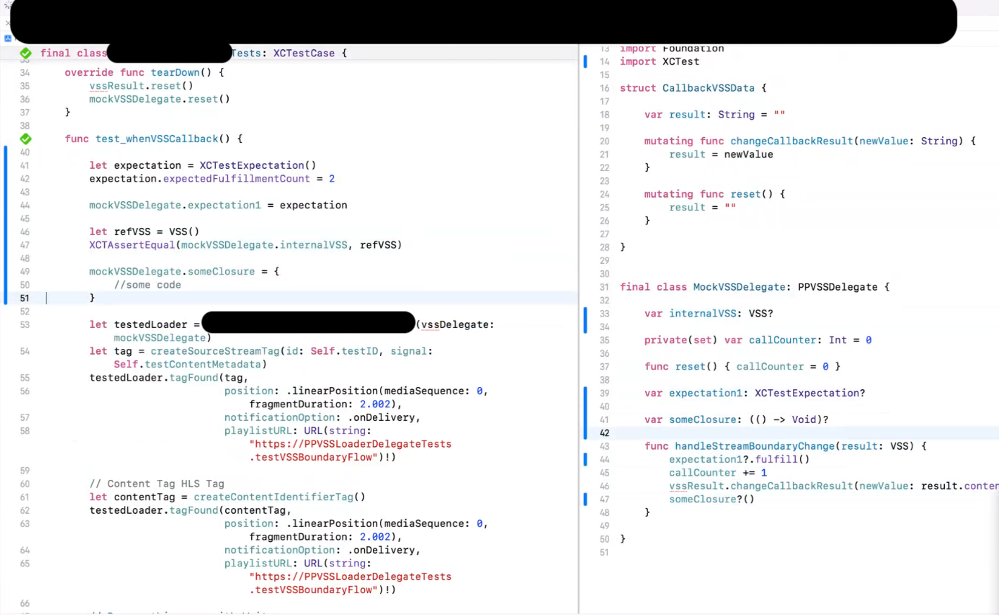

# Closures

## Intro

Closures are just a short hand version of functions in a function as a parameter passing around.

It is mostly used to run asynchronous methods and execute the closure function code only after receiving certain type of input from the parent function or service. You could say it is a synchronous method calling or promises type of behavior. In swift it is referred as “Completion handlers”

```swift
typealias Handler<OpenWeatherModel> = (Result<OpenWeatherModel, Error>) -> Void

func getWeatherDataByLatLon(latitudeWeather : Double, longitudeWeather : Double, completionHandler : @escaping Handler<OpenWeatherModel>) { 
            guard error == nil else { return completionHandler(.failure(error!)) }
            
            guard let data = data else { return }
            do {
                let response = try JSONDecoder().decode(OpenWeatherModel.self, from: data)
                completionHandler(.success(response))
            } catch let error {
                print("Error in retrieving data" + error.localizedDescription)
            }
        }
}
```


Calling closure

```swift


NetworkAPI.sharedInstance().getWeatherDataByLatLon(latitudeWeather : currLat, longitudeWeather: currLong, completionHandler : { [weak self] result in
            
            switch result {
            case .success(let data):
                print("In success block")
                self?.openWeatherResponse?.append(data)
                DispatchQueue.main.async {
                    self?.resultsTable.reloadData()
                }
            case .failure(let error): break
                // Check for internal error enum cases
                print("Some error occured")
            }
            
            
        })
        
```


## Super in closure

```error
Using 'super' in a closure where 'self' is explicitly captured is not yet supported
```


```swift

class Parent {
   func foo() {
   }
}

class Child: Parent {
   override func foo() {
      UIView.animateWithDuration(1) { [weak self] in // or any closure-producing context
         self?.super_foo()
      }
   }

   private func super_foo() {
      super.foo()
   }
}
```


## Unit Tests closure

callback example
[Open: unit tests _closure _ swift.png](../../assets/7d97352a88ec99bcc2d7a56b28c8ae68_MD5.png)


Reference

https://github.com/lionheart/openradar-mirror/issues/6765

https://stackoverflow.com/questions/24603559/store-a-closure-as-a-variable-in-swift