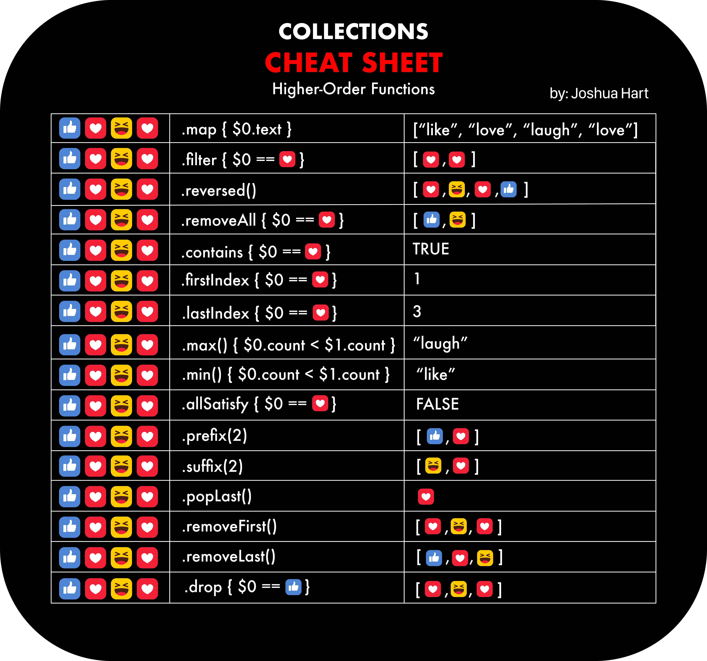

# ShortHands

It is always easier to forget which shorthands | higher order functions are available and sometimes you need a refresher in terms of an example with input and output.

## Map

RxSwift Map
[map](map.md)
## FlatMap

RxSwift FlatMap
[flatMap](flatMap.md)

## CompactMap

Removes the nil values when working with sequence variables.

```swift
let optionalArr = [1, nil, 3, 4, 6, nil, nil, 42]
let nonEmptyArr = arr.compactMap()
print(nonEmptyArr) // 1,3,4,6,42
```


## Filter

Whatever returns a true boolean value would get filtered appropriately.
Filter works on sequence variables types like Set, Array, Dictionary.

// Even Odd example

```swift
let arr = [1, 2, 3, 4]
let evens = arr.filter { $0 % 2 == 0 }
print(evens)
```

// Struct filter
```swift
struct FieldFilter {
    let hasDynamicRecordId: Bool
    let name: String
}

let arrFields = [
    FieldFilter(hasDynamicRecordId: true, name: "Test 1"),
    FieldFilter(hasDynamicRecordId: false, name: "Test 2"),
    FieldFilter(hasDynamicRecordId: false, name: "Test 3"),
    FieldFilter(hasDynamicRecordId: true, name: "Test 4"),
    FieldFilter(hasDynamicRecordId: true, name: "Test 5"),
]

let dynamicRecordFields = arrFields.filter { $0.hasDynamicRecordId }
print(dynamicRecordFields)
```


## Checking conditions in Map

If you want to check specific condition in an array with short hand - higher order functions you could utilize `allSatisfy` condition to check a specific predicate in all the elements of an array.

```swift
struct Feature { 
	let showView: Bool
	let showNotification: Bool
	let name: String			   
}
let features: [Feature] = [
	Feature(showView: true  , showNotification: false , name: "Kay"),
	Feature(showView: true  , showNotification: true , name: "Nay"),
	Feature(showView: true  , showNotification: false , name: "Say")
]

let featureShowViewSatisfy = features
								.map(\.showView)
								.allSatisfy{ $0 == true }

print(featureShowViewSatisfy) // prints true Bool
myCustomView.isVisible = featureShowViewSatisfy
```


## Collection Cheat sheet



## KeyPaths in higher order functions

[keypaths](keypaths.md)


## Note

Have added appropriate RxSwift implementations of `map, flatMap, compactMap` as well in RxSwift

## Resources

[Apple Docs](https://developer.apple.com/documentation/swift/sequence/3018365-filter)

[swiftbysundell map basics](https://www.swiftbysundell.com/basics/map-flatmap-and-compactmap/)