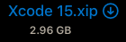
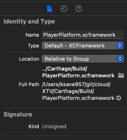
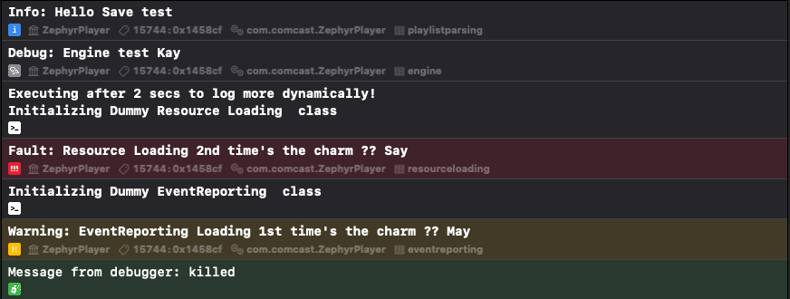
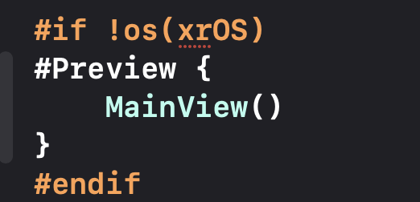
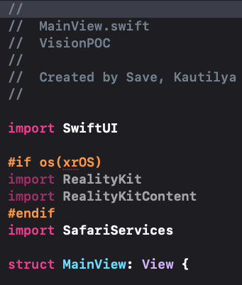
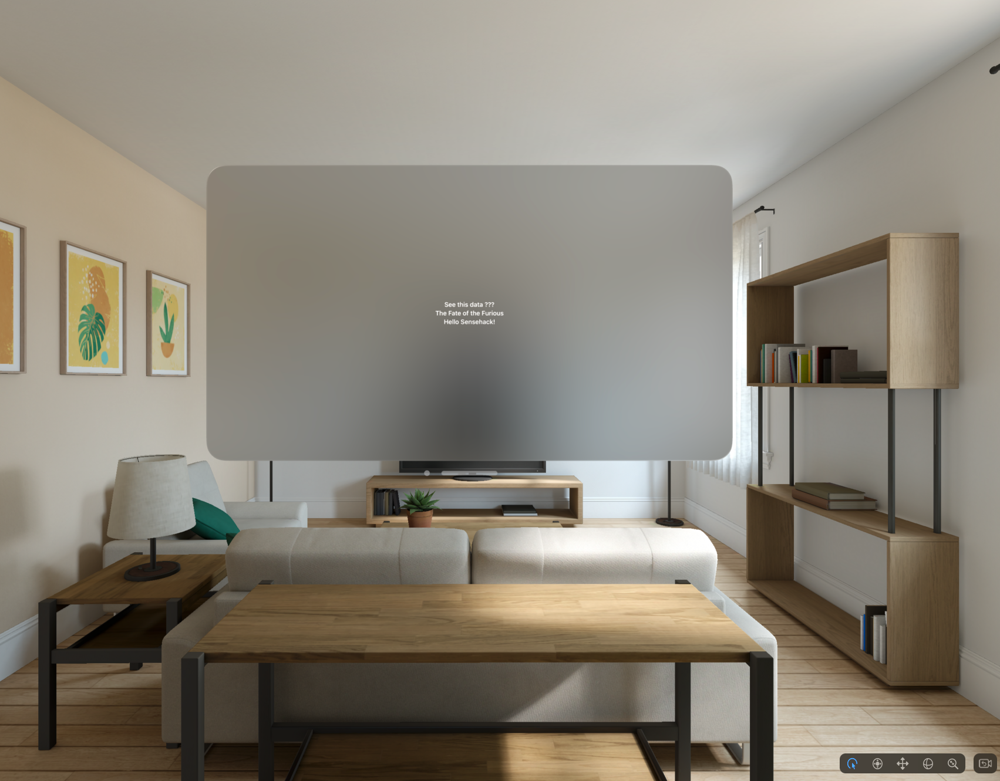
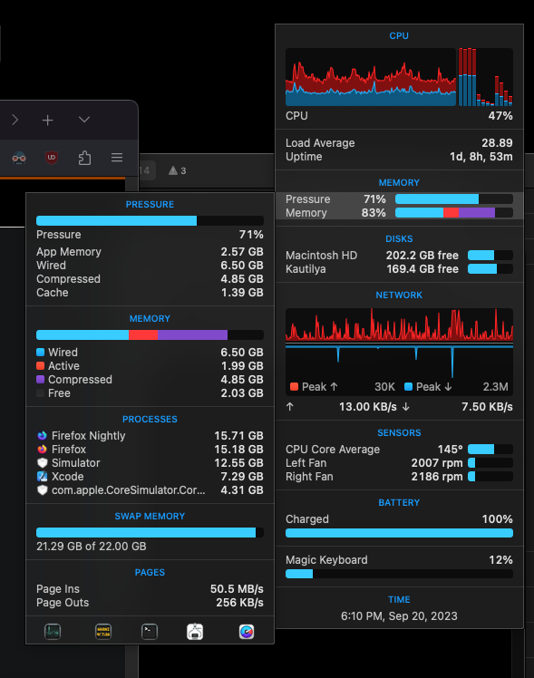

# Xcode 15

---

## Modular Installs

<split left="2" right="1" gap="2">

**ABI**  & Modularity.   
 Newer Xcode default bundle is modular which saves a lot of bandwidth and storage space on resource limited devices.

<split wrap="2">

</split>

</split>

---

##  Security Inspector

<split left="1" right="2" gap="2" style="font-size:24px">

XCFrameworks imported into the project now shows the digital signature being signed for the specific framework. eg. PlayerPlatform.xcFramework

<split wrap="2">

</split>

</split>

---

## Logging

<split left="1" right="2" gap="2" style="font-size:24px">

**Debugging**  Filters added   
 Developers leverage the apple's unified logging API with visual updates added in this release.
 
<split wrap="2">

</split>

</split>

---

## Preview & AutoCompletion

<split left="1" right="2" gap="2" style="font-size:24px">

UIKit preview now works like SwiftUI
Auto completion

<split wrap="2">

</split>

</split>

---

## Vision OS

<split left="1" right="1" gap="2">

**xrOS**  Simulator added   
Developers can play around with apple's new visionOS SDK which is planned to be released in Early 2024. 

<split wrap="2">

</split>

</split>

**case UIUserInterfaceIdiomVision**

---

## 

<grid drag="60 10" drop="topleft" bg="">
 ##### Rant VisionOS Simulator does take lot of resources.
</grid>

<grid drag="40 10" drop="left" bg="" style="font-size:24px">
 

Consumes too much memory
Need 64GB and M3Max / Ultra chips for smooth sailing since rendering 3D elements needs beefy cpu and lot of VRAM. Look at that SWAP memory usage of 22Gigs and Page Ins of 50MB/s. 

</grid>

<grid drop="bottomright">

</grid>

---
