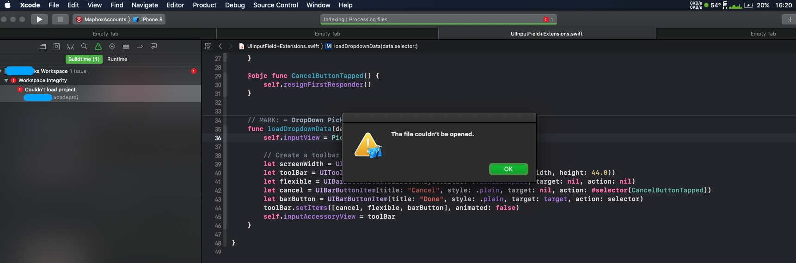
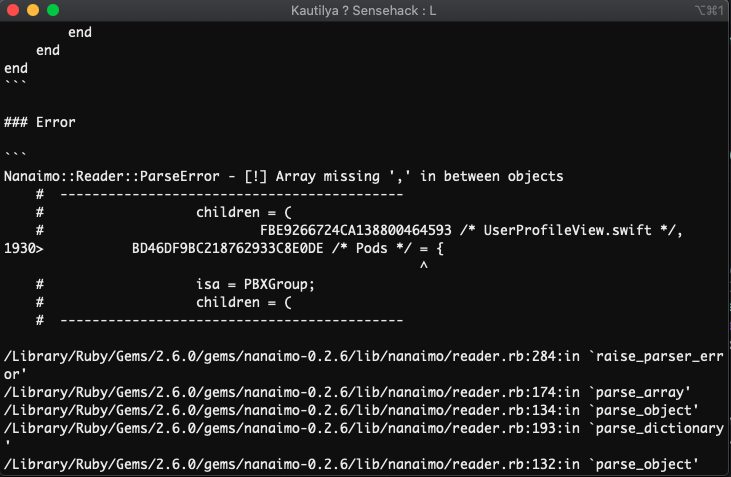
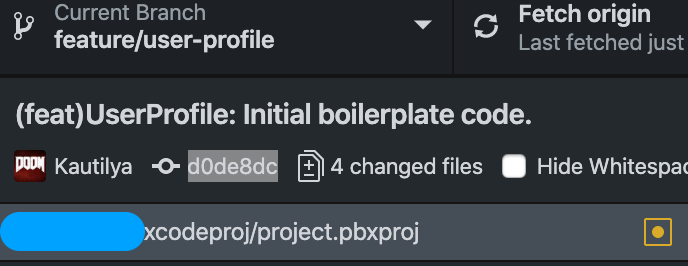
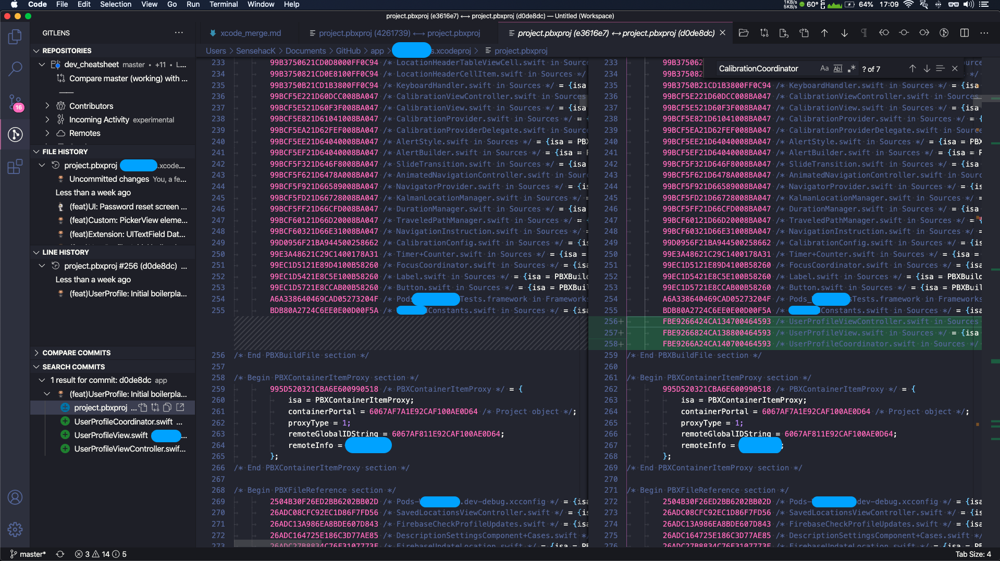
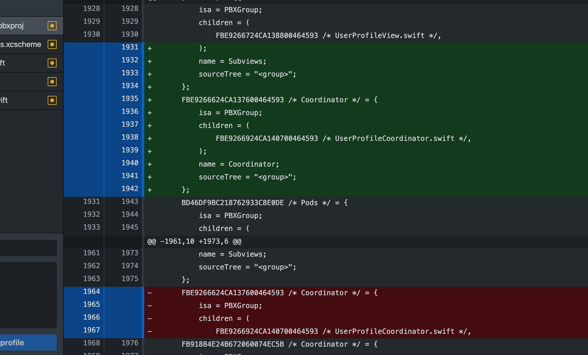
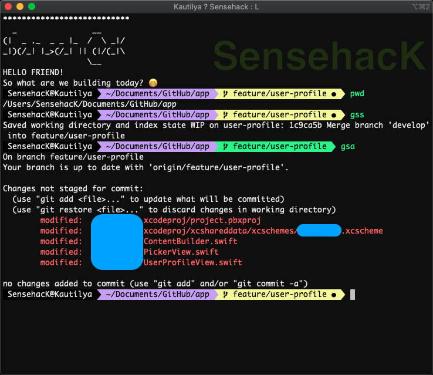

# Project Merge

### Introduction

Xcode .xcodeproj file usually works great but when working in different branches in development phase of apps could lead to merge conflicts more than usual.

So this article would address the workflow I went through for fixing it.

After solving this small Xcode project structure issue, I thought why not document it well enough for novice — intermediate developers like myself for future help in debugging exactly what string of lines corrupted the whole internal “**.xcodeproj**” folder specifically the file which stores all the references of the project structure. **“project.pbxproj”**

### Merge

So when I had taken upstream changes from develop branch to my own feature branch, I had merge conflicts before this problem. So in order to solve them I opened them in VS code and just resolved 3 merge conflicts which were mostly new files added from upstream “develop” branch with my “feature” branch.

In a hurry I did commit them without actually seeing their lines appending at different { } code blocks.  
I presumed Xcode is good enough to handle the new files from different branches and will compile them with the merge and reorder its references of files / folder itself automatically.  
After committing these changes from windows 10 workstation using vscode as Git merge usually don’t need a Mac OS.

Booted my mac, open up the project with latest merge changes on my feature branch where Xcode threw this error.

Xcode Error: Couldn’t load project

I wasn’t able to access any files from the file inspector/structure sidebar at the left. So now we move onto debugging why this is happening.

### Debug

The approach I took for solving the problem. Tools I used for tracking down the culprit of the problem are

* GitHub Desktop
* VS Code
* Xcode
* iTerm

#### Xcode

I quickly did what every developer does, search the problem on the internet.

By this time I ran the pod command in order to refresh with my project just in case any new changes committed by my team also needed library pod dependencies and their file structure being updated in the “project.pbxproj” but actual files being missing.  
_&gt; pod update_

Though Xcode is smart enough to actually throw error saying this specific file reference is missing.

So with pod command I also got a new error, which was obvious as Xcode couldn’t parse the file “project.pbxproj” so cocoa pods would also have difficulty parsing it in its CLI platform.

> Cocoapods Error:  
> \`\`\`error  
> Nanaimo::Reader::ParseError — \[!\] Array missing ‘,’ in between objects  
> \`\`\`

I quickly searched again which returned me various results specifically telling me that the dependency has a bug but the thread being old I thought I’m already on the latest library dependency and quickly moved to a different approach of the problem.

* [Cocoapods Github Issue](https://github.com/CocoaPods/CocoaPods/issues/6108)
* [Other issue link](https://github.com/CocoaPods/CocoaPods/issues/6214)
* [Developer Forum](https://developer.apple.com/forums/thread/114511)

Moved too Github for versioning changes.

#### Github Desktop

So I started checking my Git history of my feature branch and observed the git blame to where the file was last edited. I inspected that git index number “**d0de8dc**“ last 7 digits of the hash I believe.

Look for all the changes introduced by my feature branch.

Then move to open with vscode from github.

#### VS Code

Two windows one running current file version and the other windows which goes to git diff comparing new changes with git blame.  
Extensions installed on VSCode

* [Git Lens](https://marketplace.visualstudio.com/items?itemName=eamodio.gitlens)
* [Syntax Xcode Project Data](https://marketplace.visualstudio.com/items?itemName=mariomatheu.syntax-project-pbxproj)
* [Swift Language](https://marketplace.visualstudio.com/items?itemName=Kasik96.swift)

With previous revision jumping back and forth comparing files with Xcode project syntax highlighted helped me to understand what could be the problem.

The extensions listed above may have helped me to notice some small red lines in my scroll bar and I quickly jumped towards it as well as the previous error thrown by Cocoapods CLI. By navigating to that specific line number and inspecting the underlying syntax, I concluded that git merge couldn’t properly merge two branches and may have accidentally overwritten certain new changes onto already established file structure of Xcode “project.pbxproj”.

This usually happens when different branches introduces new files to the project and they are both not in sync which eventually leads up to a merge conflict.  
With that I compared my previous new additions of lines to the same file and current file and copy pasted it properly after certain code blocks ended, so that it won’t be nested inappropriately.

Double checked the references of the folder structure whether they are present in the whole file or else it just give file not found error for specific references.

#### iTerm

To verify whether this file change actually fixed something, I quit Xcode and open it again using “.xcworkspace” file as always cocoapods infused project workspace.

It worked just fine, Xcode started indexing the files. But to pinpoint what worked I stashed my uncommitted changes using git cli

_&gt; git stash_

Which saved a working copy and quit Xcode and reopen it again, threw the same error. So I popped my stash from working copy of the feature branch I was working using

_&gt; git stash apply_

& voila everything is working as its suppose too.

I really like shell alias which saves a lot of typing. You can find my dot files in my repository.

[terminal dot files](https://github.com/SensehacK/sense-setup/tree/master/terminal)

### Conclusion

As you can clearly see, there is no absolute one way to fix the problem, but with certain tools and workflow of maintaining different code space eventually leads to better insight of what went wrong and we could pinpoint with accuracy which version screwed up the code base.

Also Xcode should find a better way of handling file structure merging references in cross functional teams working in parallel on their own features.

We could resolve this by properly following “GitFlow” methodology.

Great video on good branching in cross functional teams by [Microsoft](https://www.youtube.com/watch?v=ykZbBD-CmP8&feature=emb_title).

My raw developer journey can be found on a this [github link](https://github.com/SensehacK/dev-cheatsheet) or stylized view which is current Gitbook. 

